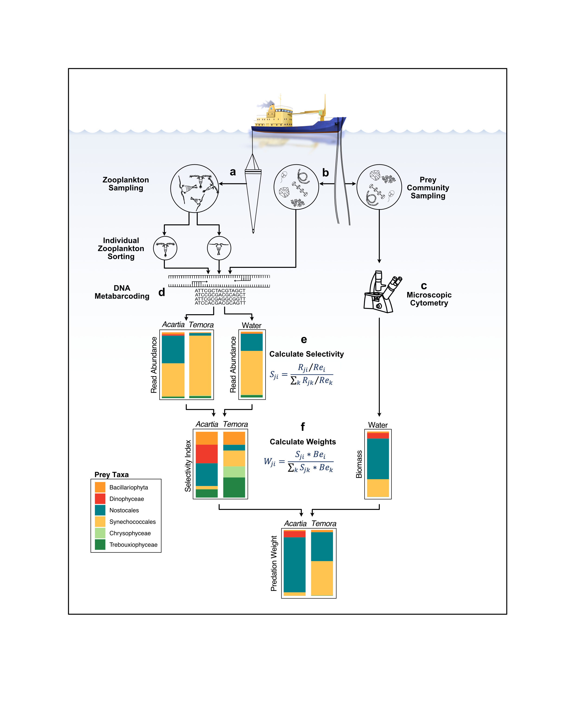

[***Andreas Novotny, Baptiste Serandour, Susanne Kortsch, Benoit Gauzens, Kinlan Mehdi Goulwen Jan, and Monika Winder***]{.underline}

**Contact:** Andreas Novotny, [mail\@andreasnovotny.se](mailto:mail@andreasnovotny.se){.email}

```{r message=FALSE}
library(tidyverse)
library(xts)
library(igraph)
library(svglite)
library(circlize)
library(lubridate)
library(forcats)
```

```{r, echo=FALSE}

#Defining orders and color schemes of organisms
ord.pred.fw <- c("Temora", "Centropages", "Pseudocalanus", "Acartia",
              "Evadne", "Bosmina", "Synchaeta", "Keratella")

ord.prey.fw <- c("Synechococcales",
              "Chlorellales", "Pyramimonadales", # Chlorophytes
              "Prymnesiales", # Haptophyta, Hacrobia
              "Pyrenomonadales", #Cryptophyta, Hacrobia
              "Chromulinales", # Chrysophyceae, Ochrophyta, SAR
              "Thalassiosirales", "Chaetocerotales", #Baclillariophyta, Ochrophyta, SAR
              "Peridiniales", #Dinoflagellata, SAR
              "Nostocales")

color.pred.fw <- c("#8c510a", #Temora
                "#bf812d", #Centropages
                "#dfc27d", #Pseudocalanus
                "#f6e8c3", #Acartia
                "#c7eae5", #Evadne
                "#80cdc1", #Bosmina
                "#35978f", #Synchaeta
                "#01665e") #Keratella

color.prey.fw <- c("#3690c0", #Synechococales
                "#238443", #Chorellales 
                "#419753", #Pyramimonadales
                "#60AB64", #Prymnesiales
                "#7FBF75", #Pyrenomonadales
                "#9DD385", #Chromulinales
                "#FEA130", #Thalassiosirales
                "#FEB23F", #Chaetocerotales
                "#ef3b2c", #Peridiniales
                "#0570b0"  #Nostocales
)

```

############################################################################## 

# 1. Data Preparations

############################################################################## 



**Figure: Overview of data preparation methods**

## 1.1 Selectivity index based on DNA metabarcoding

Individuals of zooplankton were sampled at three locations in the Baltic Sea (Landsort Deep, Gotland Deep, and Bornholm Deep) over the season between 2017 and 2020 (Fig. E1, Tab. E3). Zooplankton samples were collected with vertical hauls from 0-30 and 30-60 m using a 90 µm-WP2 plankton net. For estimating available prey composition, water samples were collected with 10L Niskin bottles with 5 m depth intervals above the thermocline of 30 m depth or with a 20 m long hose. The depths were mixed by adding an equal volume of water from the Niskin bottles. 1-3L were sequentially filtered onto 25 mm diameter filters with 20 µm, 2 µm (polycarbonate), and 0.2 µm (nylon) pore sizes. Sampling for DNA analysis followed the protocol of the Swedish national monitoring program for microscopic count data.

We used a metabarcoding assay of the V3-V4 region of 16S rRNA gene of DNA extracted from the dominant zooplankton species, including Acartia spp., Centropages hamatus, Evadne nordmanni, Pseudocalanus spp., Temora longicornis, Synchaeta baltica, Bosmina spp., Keratella spp., and the water samples. Libraries were constructed using primers 341F-805R (Herlemann et al. 2011;

et al. 2016) and the sequences were assigned to the SILVA (Pruesse et al. 2007) and PhytoREF databases (Decelle et al. 2015).

```{r}
zoopl_16S <- readRDS("./Data/16SrRNA_zp.rds") %>% 
  dplyr::mutate(StationDate = paste(STATION_ID, SAMPLE_date),
                StationDateOTU = paste(STATION_ID, SAMPLE_date, OTU),
                NODE_NAME = ifelse(SORTED_genus == "S.baltica", "Synchaeta", SORTED_genus))

head(zoopl_16S)
```

To assess the selectivity index S(i) for each prey taxon (i) of a consumer, we use the standardized forage ratio as described by (Chesson 1983). S(i) = Rg(i)/Re(i)/sum:k(Rg(k)/Re(k)) Rg(i) is the Read count of i (Abundance) in the consumers gut . Re(i) is the Read count of i in the environmental sample.

### Create a paired data set, with each OTU in both the water and gut sample on one row.

```{r}
environment <- zoopl_16S %>% 
  # Select Water samples only
  dplyr::filter(NODE_NAME == "Water")


paired_data <- zoopl_16S %>% 
  
  # Select gut samples only
  dplyr::filter(NODE_NAME != "Water") %>% 
  
  # Merge the Zooplankton and the water dataset, on the OTU level.
  dplyr::left_join(environment, by="OTU") %>% 
  
  # Remove OTUs with no read in the water sample.
  dplyr::filter(is.na(Sample.y)==FALSE,
         Abundance.y>0)

head(paired_data)
```

### Calculate Selectivity indices for each OTU and sample

```{r message=FALSE}
selectivity_data <- paired_data %>% 
  
  # Calculate preference value based on water Rg(i)/Re(i)
  dplyr::mutate(Preference = Abundance.x/Abundance.y) %>% 
  
  # Summarize per sample Preference/sum(prefeerence) ; RA(ij)/RA(iw) / sum(k, RA(kj)/RA(kw))
  dplyr::group_by(Sample.x) %>%    
  dplyr::summarize(Selectivity_index=Preference/sum(Preference),
            OTU = OTU, NODE_NAME = NODE_NAME.x,
            Domain=Domain.x, Supergroup=Supergroup.x, Class = Class.x,
            Order=Order.x, Family=Family.x, Genus=Genus.x, Species=Species.x, SAMPLE_date=SAMPLE_date.x)

head(selectivity_data)
```

### Summarize Selectivity indices for sample replicates and OTUs.

```{r message=FALSE}

summarized_selectivity <- selectivity_data %>% 
  
  # Mean Si for all OTUs for sample replicates.
  dplyr::group_by(NODE_NAME, Class, Order, Family, Genus, Species, OTU, SAMPLE_date) %>% 
  dplyr::summarise(Selectivity_index= mean(Selectivity_index)) %>%
  
  # Merge OTUs at suitable level. (Here, Class)
  dplyr::group_by(NODE_NAME, Order, SAMPLE_date) %>% 
  dplyr::summarise(Selectivity_index= sum(Selectivity_index)) %>%
  
  #Filter uniportant contributions
  dplyr::filter(Selectivity_index > 0.00) %>% 
  dplyr::group_by(NODE_NAME, SAMPLE_date) %>% 
  dplyr::summarize(Selectivity_index=Selectivity_index/sum(Selectivity_index), Order)

head(summarized_selectivity)
```

```{r}
rm(environment, paired_data, selectivity_data, zoopl_16S)
```

## 1.2 Biomasses

The population biomasses of zooplankton and phytoplankton were retrieved from the Swedish national pelagic phytoplankton and zooplankton monitoring with sampling intensity ranging between monthly and weekly samples(51). Individual body masses of phytoplankton and zooplankton were retrieved from COMBINE guidelines for plankton monitoring in the Baltic Sea(52). We calculated daily biomass estimates over one year by linearly interpolating data from samples taken between 2007 and 2018.

```{r}
Zooplankton <- readRDS("Data/Zooplankton_shark.rds")
Phytoplankton <- readRDS("./Data/Phytoplankton_shark.rds")
```

### Daily interpolation of biomass

We calculated daily biomass estimates by linearly interpolating data from samples taken between 2007 and 2018. First we define the function for daily interpolation:

```{r}


dailyInterpretation <- function(data, taxa="Genus") {
    
  require(tidyverse, xts)
  
  allDates <- seq.Date(
    #Creating a sequence of days for dataset
    min(as.Date(data$SDATE)),
    max(as.Date(data$SDATE)),
    "day")

  
  daydata <- data %>%
    
    # Turn into "matrix" format
    spread(key={{taxa}}, value=Value) %>%                 
    
    # Replaceing Nas with 0 for actual samples
    replace(is.na(.), 0) %>%                              
    
    # Adding the sequence of days to existing dataset
    full_join(x=data.frame(SDATE=allDates), y=.) %>%
    
    # Order acc to date
    arrange(SDATE) %>%
    
    # Linnear na approximation of all numeric variables in dataset
    mutate_if(is.numeric, funs(na.approx(.))) %>%                 
    
    # Back to long format
    gather(key = "Taxa", colnames(.)[-1], value = "Value") %>%    
    
    # Summarize days of each year
    mutate(Abundance = as.numeric(as.character(Value)),           
           DOY = as.numeric(strftime(SDATE, format = "%j")),
           Year = as.numeric(strftime(SDATE, format = "%Y"))) %>% 
    group_by(DOY, Taxa) %>% 
    summarize(Abundance = mean(Abundance))
  
  return(daydata)
}
```

### Daily interpolation of zooplankton biomass

```{r message=FALSE}
dip_zooplankton <- function(x) {

zoopl <- Zooplankton %>%
  dplyr::filter(Station == x,
        Depth %in% c(30,60),
         Year > 2006,
         Parameter == "Wet weight/volume",
         dev_stage_code != "NP",
         Genus %in% c(
           "Evadne",
           "Bosmina",
           "Acartia",
           "Temora",
           "Centropages",
           "Keratella",
           "Synchaeta",
           "Pseudocalanus"
           )) %>%
  group_by(SDATE, Genus) %>%
  
  summarize(Value=sum(Value)*30/1000) %>% # *30 To get the full water column, /1000 to get from mg to g.
  
  dailyInterpretation(taxa="Genus") %>% 
  mutate(NODE_NAME=Taxa, 
         Station=x)

  return(zoopl)
}

zooplankton_dip <- dip_zooplankton("BY31 LANDSORTSDJ") %>% 
  bind_rows(dip_zooplankton("BY15 GOTLANDSDJ")) %>% 
  bind_rows(dip_zooplankton("BY5 BORNHOLMSDJ"))


head(zooplankton_dip)
```

### Daily interpolation of phytoplankton

```{r message=FALSE}

dip_phytoplankton <- function(x) {


phytopl <- Phytoplankton %>% 
  
  filter(Station == x,
         Year > 2006,
         unit == 	"ugC/l") %>% 
  
  group_by(SDATE, Order, Depth) %>%
  summarize(Value=sum(Value)) %>%
  
  group_by(SDATE, Order) %>% 
  summarize(Value=mean(Value)*0.12) %>%
  # *0.12 to correct for depth *30, carbon content*4, and parameter *0.001 ug/l -> g/m
  
  dailyInterpretation(taxa="Order") %>%
  mutate(NODE_NAME=Taxa, 
         Station=x)
}

phytoplankton_dip <- dip_phytoplankton("BY31 LANDSORTSDJ") %>% 
  bind_rows(dip_phytoplankton("BY15 GOTLANDSDJ")) %>% 
  bind_rows(dip_phytoplankton("BY5 BORNHOLMSDJ"))

head(phytoplankton_dip)

```

## 1.3 Combine data sets to Links and Edges

In this section we match the different data sources to create a data frame describing the edges (organism groups) of the food web, and one matrix describing the links (feeding selectivity) of the edges.

### Filter and merge biomass data

```{r}
# List prey orders detected in zooplankton guts
zp_prey <- summarized_selectivity %>%
  pull(Order) %>% 
  unique()

# Filter biomass data by detected prey only
phytoplankton_abundance <- phytoplankton_dip %>% 
  filter(NODE_NAME %in% zp_prey) %>% 
  select(DOY, Abundance, NODE_NAME, Station)

# Plot all sources per station
phytoplankton_abundance %>% 
ggplot(aes(DOY, Abundance)) +
  geom_line(aes(color=NODE_NAME)) +
  facet_wrap(~Station)

head(phytoplankton_abundance)

Biomasses <- zooplankton_dip %>% 
  select(DOY, Abundance, NODE_NAME, Station) %>% 
  union(phytoplankton_abundance)


```

### Filter selectivity data, Links

```{r message=FALSE}
# List potential prey that is detected or monitored in the water microscopically
pp <- phytoplankton_abundance %>%
  pull(NODE_NAME) %>% 
  unique()

# Filter selectivity dataset by prey availability
Links <- summarized_selectivity %>% 
  filter(Order %in% pp) %>%
  mutate(Predator = NODE_NAME, Prey = Order) %>% 
  group_by(Predator, Prey) %>% 
  summarise(Preference = mean(Selectivity_index))

# Save Selectivity index table
pivot_wider(Links, names_from = Prey, values_from = Preference, values_fill = 0) %>% 
  relocate(c("Predator",rev(ord.prey.fw))) %>% 
  arrange(match(Predator, ord.pred.fw)) %>%
  
  write_csv("./Outputs/SI.csv")

head(Links)
```

## 1.4 Construct data with information of nodes

```{r}
bodymasses <- tibble(NODE_NAME = c("Pseudocalanus",
                                   "Temora",
                                   "Centropages",
                                   "Acartia",
                                   "Evadne",
                                   "Bosmina",
                                   "Keratella",
                                   "Synchaeta"),
                     BODYMASS = c(1.69E-05,
                                  1.69E-05,
                                  1.69E-05, 
                                  9.50E-06,
                                  3.44E-05,
                                  3.44E-05,
                                  1.00E-06,
                                  6.00E-06))
nodenames <- Biomasses %>% 
  pull(NODE_NAME) %>% 
  unique() %>% tibble(NODE_NAME = .)

Nodes <- merge(bodymasses, nodenames, by=c("NODE_NAME"), all = T) %>%  
  mutate(BODYMASS = ifelse(NODE_NAME %in% bodymasses$NODE_NAME, as.numeric(BODYMASS), 1),
         ORG_TYPE = ifelse(NODE_NAME %in% bodymasses$NODE_NAME, "Animal", "Plant"))
         
head(Nodes)
```

## 1.5 Save all modified datasets

```{r}
saveRDS(Links, "./Data/Mod/Links.rds")
saveRDS(Nodes, "./Data/Mod/Nodes.rds")
saveRDS(Biomasses, "./Data/Mod/Biomasses.rds")
```

Clear the environment

```{r}
rm(list = ls())
```

############################################################################## 

# 2. Model Definition

############################################################################## 

Read in pre filtered data sets that the model is based on.

```{r}
Links <- readRDS("./Data/Mod/Links.rds")
Nodes <- readRDS("./Data/Mod/Nodes.rds")
Biomasses <- readRDS("./Data/Mod/Biomasses.rds")
Temperatures <- readRDS("./Data/Temperatures.rds")
```

## 2.1 Define functions for model parameters

### modifyNodeData()

The metabolic rate for each node was calculated based on metabolic scaling theory (4), where the metabolic rate Xi (J/s) is derived from species' body masses Mi and an allometric scaling constant, i.e., a normalization constant a =17.17 for invertebrates and a = 18.47 for vertebrates. Bei represents the total population biomass per area unit (g/m2) and is multiplied by the metabolic rate (flux per gram biomass) to obtain a metabolic rate estimate at the population level. Metabolic rates are also adjusted to ambient temperature, where E is the activation energy, K is Boltzmann's constant, and T is the absolute temperature in Kelvin.

```{r}
#' For a given date, construct the Node dataframe

#' Calculates Losses, Efficiencies, and adds biomasses
#' This is NOT a general function for export

#' @param nodes Nodes dataframe Should contain: BODYMASS, ORG_TYPE, and NODE_NAME
#' @param links DataFrame with links: Predator, Prey, Preference
#' @param biomasses Dataframe with biomass information: DOY, Abundance, NODE_NAME and Station
#' @param temperatures Dataframe with temperature: DOY and Temperature
#' @param doy Integer: What day of the year?
#' @param station Character string: Name of the station
#' @value data.frame

modifyNodeData <- function(nodes=Nodes, links=Links, biomasses=Biomasses, temperatures=Temperatures, doy=280, station="BY31 LANDSORTSDJ") {
  
  # Calculate LOSSES and define EFFICIENCIES based on metabolic type and temperature
  temp <- temperatures %>% 
    dplyr::filter(DOY==doy) %>% 
    dplyr::pull(Temperature)
  
  boltz <- 0.00008617343  # Boltzmann constant
  tkonst <- 0.69/(boltz*(273.15+temp)) #Temperature metabolic constant
  
  nodes_tmp <-  nodes %>%
    dplyr::mutate(LOSSES = exp(-0.29 * log(BODYMASS) +
                                 dplyr::recode(ORG_TYPE ,
                                               "Animal" = 17.17,
                                               "ectotherm vertebrates" = 18.47,
                                               "Plant" = 1) -
                                 tkonst),

                  
                  EFFICIENCIES = dplyr::recode(ORG_TYPE,
                                               "Plant" = 0.77,
                                               "Detritus" = 0.4,
                                               "Animal" = 0.906,
                                               "Bacteria" = 0.906))
#Notes: Detritus derived from:Gergs, R. and K. O. Rothhaupt (2008) in Freshwater Biology 53: 2494-250. However, in practice all resources in this model are "Plants", and all resources are "Animals", non ectothermal. All other numbers are not utilized. 
  
  # Add BIOMASS to node data frame
  nodes_doy <- biomasses %>% 
    dplyr::filter(DOY==doy, Station==station) %>% 
    left_join(nodes_tmp, by="NODE_NAME")
  
 
  # Rearrange dataframe to overlap with LINKS data.
  fluxnames <- links %>% 
    graph.data.frame() %>%
    get.adjacency(attr="Preference") %>%
    as.matrix() %>% 
    colnames()
  
  nodes_doy <- nodes_doy[match(fluxnames, nodes_doy$NODE_NAME),] %>% 
    as.data.frame()
  row.names(nodes_doy) <- nodes_doy$NODE_NAME
  
  return(nodes_doy)
  
}

```

### makeFluxing()

We used a bioenergetic model described by29 to calculate energy fluxes (J/day/m2) between all nodes in the food web for each day of the year, and each of the three stations. The model builds on a steady-state assumption where the energy consumption of each species equals the energetic losses (Gi = Li). In this model, losses of each population (Li) were defined as the sum of metabolic losses for the population, and the energy flux lost to predation. Gains for each population were calculated as the sum of all fluxes from prey to predator multiplied with the assimilation efficiency, i.e., conversion of consumed biomass into energy and an absolute prey preference constant. The efficiency was based on the functional group of the prey and put to 0.7755. The prey preference was based on the selectivity index calculated from DNA abundances scaled with the relative biomass abundance of the prey species.


```{r}
#' Constructs an Adjacencty matrix from pairwise weighted links dataset

#' @param edgelist A dataframe with edges containing col1: Pred, Col2: Prey.
#' @param weight Column name that contains whe edge weight.

#' @value numeric.matrix

edgelistToAdjacency <- function(links=Links, weight="Preference") {
  
  graph <- graph.data.frame(links)
  mat <- get.adjacency(graph, attr=weight) %>% as.matrix()
  
  adjacency <- mat %>% 
    unlist() %>% 
    as.numeric() %>% 
    matrix(nrow=nrow(mat))
  return(adjacency)
  adjacency
}


#' Calculate fluxes in food web

#' Wrapper of fluxweb::fluxing
#' Not a general function for export.

#' @param nodes Data.frame, preferably output of modifyNodeData
#' @param links Data.frame containing edges

makeFluxing <- function(nodes=Nodes, links=Links) {
  
  require(tidyverse)
  require(igraph)
  require(fluxweb)
  
  # Define and save the col and row names as vector
  fluxnames <- links %>% 
    graph.data.frame() %>%
    get.adjacency(attr="Preference") %>%
    as.matrix() %>% 
    colnames()
  
  # Calculate fluxes
  flux <- links %>% 
    edgelistToAdjacency() %>% # Make square numeric matrix.
    t() %>% 
    fluxing(biomasses = nodes$Abundance,
            losses = nodes$LOSSES,
            efficiencies = nodes$EFFICIENCIES,
            bioms.prefs = TRUE,
            ef.level = "prey",
            bioms.losses = TRUE
    )
  
  # Put names on matrix
  colnames(flux) <- fluxnames
  row.names(flux) <- fluxnames
  
  return(flux)
}
```

### summarize fluxesPerYear()

We calculated fluxes (J/day/m2) between all nodes in the food webs for each day of the year and each station.

```{r}
#' Converts matrix to long format dataframe

#' @param mat a matrix
#' @value tibble. Col1: rownames(mat), col2: colnames(mat), col3: mat.

matToDf <- function(mat) {
  
  DF <- list(
    Row = rownames(mat)[row(mat)] %||% row(mat),
    Col = colnames(mat)[col(mat)] %||% col(mat),
    value = mat
  ) %>%
    map_dfc(as.vector) %>% 
    as_tibble()
  return(DF)
  
}


#' Calculates fluxes as data frame

#' Wrapper of fluxweb::fluxing
#' Not a general function for export

#' @param nodes Nodes dataframe Should contain: BODYMASS, ORG_TYPE, and NODE_NAME
#' @param links DataFrame with links: Predator, Prey, Preference
#' @param biomasses Dataframe with biomass information: DOY, Abundance, NODE_NAME and Station
#' @param temperatures Dataframe with temperature: DOY and Temperature
#' @param doy Integer: What day of the year?
#' @param station Character string: Name of the station

#' @value data.frame


fluxingDataFrame <- function(nodes = Nodes, links = Links, biomasses = Biomasses, temperatures = Temperatures,
                             doy = 255, station = "BY31 LANDSORTSDJ") {
  
  data <- modifyNodeData(nodes = nodes, links = links, biomasses = biomasses, temperatures = temperatures,
                             doy = doy, station = station) %>% 
    makeFluxing(links = links) %>%
    matToDf() %>%
    mutate(DOY=doy, Station=station, Predator = Col, Prey = Row, Flux = value) %>% 
    dplyr::select(Predator, Prey, Flux, DOY, Station)
  
  return(data)
}


fluxPerDay <- function(Station) {
  
  mapply(fluxingDataFrame, doy=30:340,
         MoreArgs = list(station = Station, nodes = Nodes, links = Links, biomasses = Biomasses, temperatures = Temperatures),
         SIMPLIFY = FALSE) %>% 
    bind_rows() %>% 
    return()
}


```

## 2.2 Computation and Calculations of metrics

### Calculate fluxes for for all days and stations

```{r}

full_model_df <- mapply(fluxPerDay, Station=c("BY31 LANDSORTSDJ",
                                              "BY15 GOTLANDSDJ",
                                              "BY5 BORNHOLMSDJ"),
                        SIMPLIFY = FALSE) %>% 
  bind_rows() %>% 
  mutate(Flux=Flux*86.4) #Modify unit from j/m2/s to Kj/m2/day
  
head(full_model_df)
```

### Calculate metrics per day

For each node and day of the year, we calculated the total predation losses, normalized predation pressure, and total consumption. We also calculated annual food web metrics by summarizing all daily flux networks (J/year/m2).

```{r message=FALSE}
#predator info


Pred_flux <- full_model_df %>%
  mutate(NODE_NAME = Predator) %>% 
  group_by(NODE_NAME, DOY, Station) %>% 
  summarize(Consumption=sum(Flux))

head(Pred_flux)

Summary_statistics_stations <- full_model_df %>%
  mutate(NODE_NAME = Prey) %>% 
  
  # Calculate predation loss
  group_by(NODE_NAME, DOY, Station) %>% 
  summarize(Predation_loss=sum(Flux)) %>%
  left_join(Biomasses) %>%
  left_join(Pred_flux) %>% 
  mutate(Predation_pressure=Predation_loss/Abundance) %>% 
  gather(key = "Parameter", value = "Value", Abundance,
         Predation_loss, Predation_pressure, Consumption)

Summary_statistics_all <- Summary_statistics_stations %>% 
  group_by(NODE_NAME, DOY, Parameter) %>% 
  summarize(Value=mean(Value))

head(Summary_statistics_all)

```

## 2.3 Plotting

### Define order and color scheme for plots

Order for food web plot

```{r}

ord.pred.fw <- c("Temora", "Centropages", "Pseudocalanus", "Acartia",
              "Evadne", "Bosmina", "Synchaeta", "Keratella")

ord.prey.fw <- c("Synechococcales",
              "Chlorellales", "Pyramimonadales", # Chlorophytes
              "Prymnesiales", # Haptophyta, Hacrobia
              "Pyrenomonadales", #Cryptophyta, Hacrobia
              "Chromulinales", # Chrysophyceae, Ochrophyta, SAR
              "Thalassiosirales", "Chaetocerotales", #Baclillariophyta, Ochrophyta, SAR
              "Peridiniales", #Dinoflagellata, SAR
              "Nostocales")

color.pred.fw <- c("#8c510a", #Temora
                "#bf812d", #Centropages
                "#dfc27d", #Pseudocalanus
                "#f6e8c3", #Acartia
                "#c7eae5", #Evadne
                "#80cdc1", #Bosmina
                "#35978f", #Synchaeta
                "#01665e") #Keratella

color.prey.fw <- c("#3690c0", #Synechococales
                "#238443", #Chorellales 
                "#419753", #Pyramimonadales
                "#60AB64", #Prymnesiales
                "#7FBF75", #Pyrenomonadales
                "#9DD385", #Chromulinales
                "#FEA130", #Thalassiosirales
                "#FEB23F", #Chaetocerotales
                "#ef3b2c", #Peridiniales
                "#0570b0"  #Nostocales
)

```

Order for line diagrams

```{r}

ord.pred <- c("Temora", "Centropages", "Pseudocalanus", "Acartia",
              "Evadne", "Bosmina", "Synchaeta", "Keratella")

ord.prey <- c("Synechococcales", "Nostocales",
              "Thalassiosirales", "Chaetocerotales", #Baclillariophyta, Ochrophyta, SAR
              "Peridiniales", #Dinoflagellata, SAR
              "Chlorellales", "Pyramimonadales", # Chlorophytes
              "Prymnesiales", # Haptophyta, Hacrobia
              "Pyrenomonadales", #Cryptophyta, Hacrobia
              "Chromulinales" # Chrysophyceae, Ochrophyta, SAR
              )

color.pred <- c("#8c510a", #Temora
                "#bf812d", #Centropages
                "#dfc27d", #Pseudocalanus
                "#f6e8c3", #Acartia
                "#c7eae5", #Evadne
                "#80cdc1", #Bosmina
                "#35978f", #Synchaeta
                "#01665e") #Keratella

color.prey <- c("#3690c0", #Synechococales
                "#0570b0", #Nostocales
                "#FEA130", #Thalassiosirales
                "#FEB23F", #Chaetocerotales
                "#ef3b2c", #Peridiniales
                "#238443", #Chorellales 
                "#419753", #Pyramimonadales
                "#60AB64", #Prymnesiales
                "#7FBF75", #Pyrenomonadales
                "#9DD385", #Chromulinales
                "#FEA130", #Thalassiosirales
                "#FEB23F", #Chaetocerotales
                "#ef3b2c") #Peridiniales


names(color.pred) <- ord.pred
names(color.prey) <- ord.prey


scale_color_pred <- scale_color_manual(breaks = ord.pred,
                                       values = color.pred)

scale_color_prey <- scale_color_manual(breaks = ord.prey,
                                       values = color.prey)

scale_fill_prey <- scale_fill_manual(breaks = ord.prey,
                                       values = color.prey)

```

```{r}
scale_x_doymonth <- scale_x_continuous('Month',breaks=seq(0,365,by=30.5),
                                       limits=c(0,366),
                                       labels=c("Jan","Feb","Mar","Apr","May","Jun",
                                                "Jul","Aug","Sep","Oct","Nov","Dec"),
                                       expand = c(0,0))
```

### Fig. 2 (inner) Annual Fluxes

```{r message=FALSE}
fw_df <- full_model_df %>%
  
  # Calculate Sum fluxes of all days per year
  group_by(Predator, Prey, Station) %>% 
  summarize(Flux = sum(Flux)) %>%
  
  # Calculate Mean fluxes between station
  group_by(Predator, Prey) %>% 
  summarise(Flux = mean(Flux)) %>%
  
  # Make bipartite matrix format
  filter(Flux > 0)

fw_mat <- fw_df %>% 
  spread(Predator, Flux, fill=0) %>% 

  # Order the food web with defined orders
  relocate(ord.pred.fw) %>%   #Columns
  arrange(match(Prey, rev(ord.prey.fw))) %>%  #Rows
  column_to_rownames("Prey") %>%
  as.matrix()


circos.clear()
chordDiagram(fw_mat, grid.col = c(rev(color.prey.fw), color.pred.fw),
             annotationTrack = c("grid", "axis"), directional = 1,
             direction.type = c("diffHeight", "arrows"), link.arr.type = "big.arrow")
```

Save plot:

```{r include=FALSE}
{
pdf(file="./Outputs/Fig.2.annual.pdf",
  width=5, 
  height=4, 
  pointsize=12)
  
circos.clear()
chordDiagram(fw_mat, grid.col = c(rev(color.prey.fw), color.pred.fw),
             annotationTrack = c("grid", "axis"), directional = 1,
             direction.type = c("diffHeight", "arrows"), link.arr.type = "big.arrow")
dev.off()
  }

```

Save summary matrix:

```{r}
fw_mat %>% 
  as.data.frame() %>%
  rownames_to_column() %>% 
  write_csv("./Outputs/Fluxes.csv")

```

### Fig. 2 (outer) Fluxes per month

Prepare a food web matrix

```{r message=FALSE}
fw_df <- full_model_df %>% 
  mutate(Month = month(as_date(DOY))) %>% 
  
  # Calculate Sum fluxes of all days per year
  group_by(Predator, Prey, Station, Month) %>% 
  summarize(Flux = sum(Flux)) %>%
  
  # Calculate Mean fluxes between station
  group_by(Predator, Prey, Month) %>% 
  summarise(Flux = mean(Flux)) %>%
  
  # Make bipartite matrix format
  filter(Flux > 0)

head(fw_df)
```

Filter and plot per month

```{r include=FALSE}

plot_fw <- function(m=6){
  
 fw_mat <- fw_df %>%
   filter(Month == m) %>%
   select(Predator, Prey, Flux) %>% 
   spread(Predator, Flux, fill=0) %>%
   
  # Order the food web with defined orders
  relocate(ord.pred.fw) %>%   #Columns
  arrange(match(Prey, rev(ord.prey.fw))) %>%  #Rows
  column_to_rownames("Prey") %>%
  as.matrix()

{
pdf(file= paste("./Outputs/Fig.2.month", m, ".pdf", sep = ""),
  width=5, 
  height=4, 
  pointsize=12)
  
circos.clear()
chordDiagram(fw_mat, grid.col = c(rev(color.prey.fw), color.pred.fw),
             annotationTrack = c("grid"), directional = 1,
             direction.type = c("arrows"), link.arr.type = "big.arrow")
dev.off()
  } 

}

#Execute
map(2:11, plot_fw)


```

Calculate monthly

```{r message=FALSE}
fw_df %>% 
  group_by(Month) %>% 
  summarize(Flux=sum(Flux)) %>% 
  mutate(Fluxsqrt=sqrt(Flux))
```

### Fig. 3 Selectivity indices

```{r message=FALSE}
si_mat <- Links %>%
  
  group_by(Predator) %>% 
  summarize(Preference=Preference/sum(Preference),
            Prey = Prey) %>%
  mutate(Predator = factor(Predator, ord.pred),
         Prey = factor(Prey, ord.prey)) %>% 
  ggplot() +
  geom_bar(aes(x=Predator, y=Preference, fill = Prey), stat = "identity") +
  scale_fill_prey +
  theme_minimal() +
  theme(axis.text.x = element_text(angle = 90))

si_mat

ggsave("./Outputs/fig.3.pdf",plot = si_mat, width = 5, height = 3)

```

### Fig. 4 Plot Summary metrics

#### Fig. 4a Phytoplankton biomass

```{r warning=FALSE}
fig.4a <- Summary_statistics_all %>%
  filter(Parameter=="Abundance",
         NODE_NAME %in% ord.prey) %>% 
  ggplot(aes(DOY, Value)) +
  geom_line(aes(color=NODE_NAME)) +
  scale_x_doymonth +
  scale_color_prey +
  scale_y_continuous(expression(paste('Biomass(WW) (g / '~m^{2}~')'))) +
  labs(color='Prey') +
  theme_classic() +
  theme(axis.text.x = element_text(angle = 90, vjust = 0.5, hjust=1))

fig.4a
```

#### Fig. 4b Zooplankton biomass

```{r warning=FALSE}
fig.4b <- Summary_statistics_all %>%
  filter(Parameter=="Abundance",
         NODE_NAME %in% ord.pred) %>% 
  ggplot(aes(DOY, Value)) +
  geom_line(aes(color=NODE_NAME)) +
  scale_x_doymonth +
  scale_color_pred +
  scale_y_continuous(expression(paste('Biomass(WW) (g / '~m^{2}~')'))) +
  labs(color='Predator') +
  theme_classic() +
  theme(axis.text.x = element_text(angle = 90, vjust = 0.5, hjust=1))

fig.4b
```

#### Fig. 4c Predation losses (Secondary production)

```{r warning=FALSE}
fig.4c <- Summary_statistics_all %>%
  filter(Parameter=="Predation_loss",
         NODE_NAME %in% ord.prey) %>% 
  ggplot(aes(DOY, Value)) +
  geom_line(aes(color=NODE_NAME)) +
  
  scale_x_doymonth +
  scale_color_prey +
  scale_y_continuous(expression(paste('Secondary production (kJ / day /'~m^{2}~')'))) +
  labs(color='Prey') +
  theme_classic() +
  theme(axis.text.x = element_text(angle = 90, vjust = 0.5, hjust=1))

fig.4c
```

#### Fig. 4d Predation Pressure

```{r warning=FALSE}
fig.4d <- Summary_statistics_all %>%
  filter(Parameter=="Predation_pressure",
         NODE_NAME %in% ord.prey) %>% 
  ggplot(aes(DOY, Value)) +
  geom_line(aes(color=NODE_NAME)) +
  
  scale_x_doymonth +
  scale_color_prey +
  scale_y_continuous(expression(paste('Predation pressure (kJ / day / g)'))) +
  labs(color='Prey') +
  theme_classic() +
  theme(axis.text.x = element_text(angle = 90, vjust = 0.5, hjust=1))

fig.4d
```

#### Combine and save

```{r warning=FALSE}
fig.4 <- ggpubr::ggarrange(fig.4a, fig.4b, fig.4c, fig.4d)

ggsave("./Outputs/fig.4.pdf",plot = fig.4, width = 8, height = 5)
```

# 3. Session Info

```{r}
sessionInfo()
```
